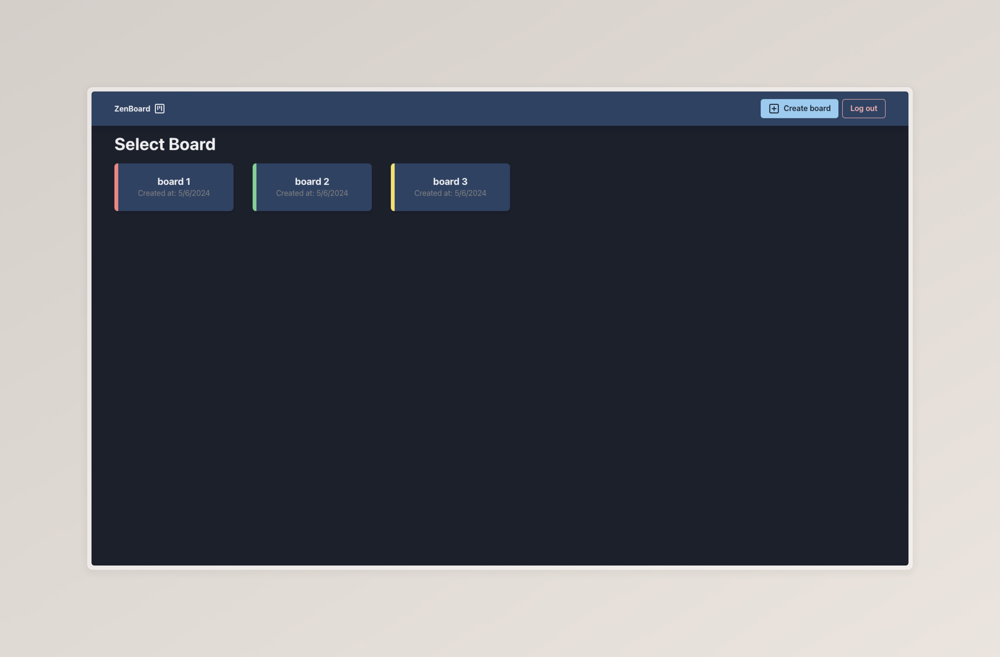

<br />
<div align="center">

<h3 align="center">ZenBoard</h3>

[Live demo](https://task-management-gamma-eight.vercel.app/)

</div>

<details>
  <summary>Table of Contents</summary>
  <ol>
    <li>
      <a href="#about-the-project">About The Project</a>
      <ul>
        <li><a href="#built-with">Built With</a></li>
        <li><a href="#features">Features</a></li>
      </ul>
    </li>
    <li>
      <a href="#getting-started">Getting Started</a>
      <ul>
        <li><a href="#prerequisites">Prerequisites</a></li>
        <li><a href="#installation">Installation</a></li>
      </ul>
    </li>
    <li><a href="#contact">Contact</a></li>
  </ol>
</details>

## About The Project



Zenboard is a Kanban-style project management tool, where tasks are organized effortlessly into customizable columns, promoting clarity with its minimalist design and intuitive interface.

[Live demo](https://task-management-gamma-eight.vercel.app/)

<p align="right">(<a href="#readme-top">back to top</a>)</p>

### Built with

- [React](https://react.dev/)
- [TypeScript](https://www.typescriptlang.org/)
- [ChakraUI](https://v2.chakra-ui.com/)
- [Vite](https://vitejs.dev/)
- [Tanstack Query](https://tanstack.com/query/latest)
- [Tanstack Router](https://reactrouter.com/en/main)
- [Firebase](https://firebase.google.com/)
- [Cypress](https://www.cypress.io/)

<p align="right">(<a href="#readme-top">back to top</a>)</p>

## Features

- [x] User Auth
- [x] Add Boards
- [x] Add Cards
- [x] Add Tasks
- [ ] Drag&Drop
- [ ] Assign Tasks to specific User

<p align="right">(<a href="#readme-top">back to top</a>)</p>

## Getting Started

To get a local copy up and running follow these simple steps.

### Prerequisites

- npm
  ```sh
  npm install npm@latest -g
  ```

### Installation

1. Clone the repo
   ```sh
   git clone https://github.com/rynkovski/task-management.git
   ```
2. Install NPM packages
   ```sh
   npm i
   ```
3. Start

   ```sh
   npm start
   ```

   <p align="right">(<a href="#readme-top">back to top</a>)</p>

## Contact

[@rynkovski](https://github.com/rynkovski)

<p align="right">(<a href="#readme-top">back to top</a>)</p>
